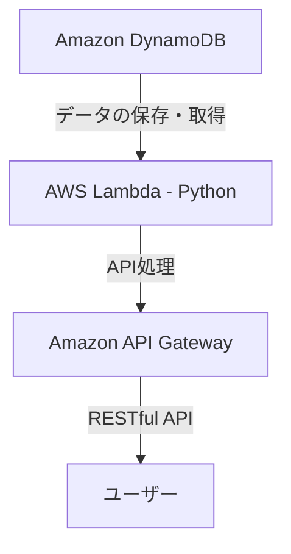

# aws-server-less-web-api-practice

AWS 環境におけるサーバーレス Web API 構築の練習

クライアントから任意の文字列を送るとデータベースに格納され、また、その文字列をクライアントは取得することができる。

## 役割

```txt
Amazon DynamoDB (NoSQL)
｜
AWS Lambda (Python) **本リポジトリの扱う要素**
｜
Amazon API Gateway
｜
ユーザー
```


